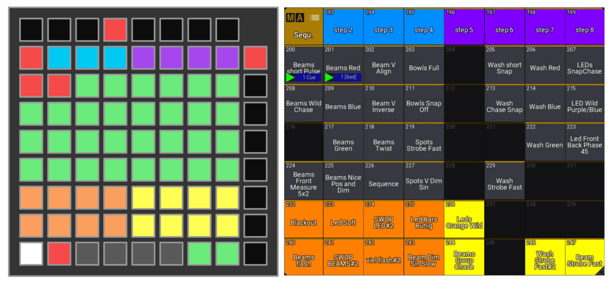
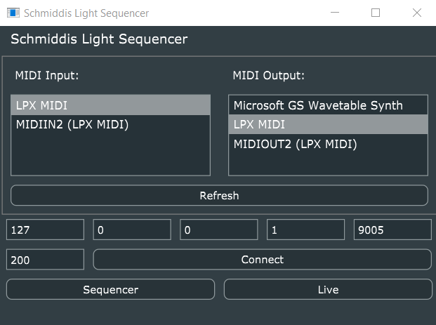

# Schmiddis LaunchPad Sequencer (SLPS)

Schmiddis LaunchPad Sequencer (SLPS) is a sequencer for the LaunchPad X, which can send OSC messages directly to GrandMA3. This makes it possible to play *GrandMA3Sequences* like an insturment and to create beat-accurate Chaser Live.

## But why?

Controlling lights in the club to electronic music is fun but the connection to the music was somewhat lacking. Although you can move faders and fire off your swap effects with buttons to drops, it's not really possible to recreate the song with the fixtures and that made long club nights a bit monotonous for me.
The LaunchPad X is for me a good controller for club use, because it offers many buttons and virtual faders, making it possible to play exclusively on the controller, which allows me to get into the flow faster.

## What is SLPS exactly?

SLPS is a step sequencer. You tap the beat and then the sequencer jumps to each beat one step further. For each step you can select different *GrandMA3Sequences* (note the difference between Sequence and *GrandMA3Sequence*... they are something completely different), which are triggered when the step is reached. In other words, instead of playing a kick, a hi-hat or other drums, with SLPS you play the dimmers and the position of your moving heads, your strobes and your blinders. This allows you to create a beat-synchronized mood on the floor and when the drop comes, you can of course fire your swap effects via extra buttons. 

The above example shows a four step sequence, which triggers the *GrandMA3Sequence* 200 and 201 in the first step and the *GrandMA3Sequence* 200 in the third step. Assuming on the *GrandMA3Sequence* 200 is the dimmer of moving heads and on the 2 a color for these, then the heads light up white in the first step and red in the third step. Imagine you have a four to the floor beat and on the first and third beat is the clap, then the moving heads light up now always to the clap.

## How to use SLPS? 

You take the 4 MB .exe file on your USB stick and run it on the computer your LaunchPad X is connected to.  In the gui you can select your midi device at the top and the IP address and OSC port of GrandMa3 at the bottom. If GrandMA3 onPC is running on the same computer as SLPS you leave the IP 127.0.0.1. The 200 next to the Connect button is the sequence offset for GrandMA3. 200 means that the first green button (top left) triggers the GrandMA3Sequence 200, the second 201 and so on.

For my setup I create custom pages with faders for GroupMaster and buttons for swap effects on the LaunchPad and map (Midi -> OSC) them with the great program [Chataigne](https://github.com/benkuper/Chataigne). For this I can recommend the [grandMA3-Chataigne-Module](https://github.com/yastefan/grandMA3-Chataigne-Module). The sequencer surface can be opened via the gui of SLPS or via Midi (Channel 16, CC 100).

## Instruction manual

